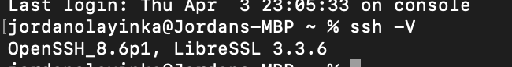
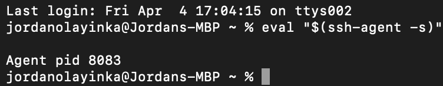
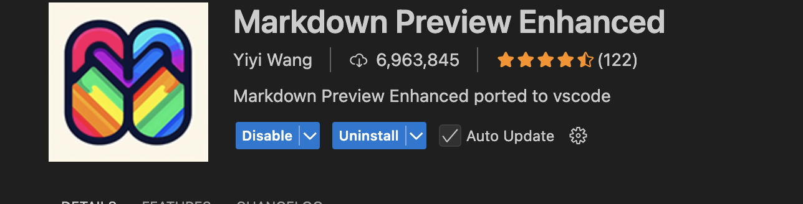

# How I Installed Everything on My MacBook

Here’s exactly how I set up SSH, SSH-Agent, Markdown, and VSCode on my MacBook. 

---

## 1. Setting Up SSH (Secure Shell)

I first checked if SSH was already installed. I opened **Terminal** and ran:
```sh
ssh -V
```
Since SSH is built into macOS, it was already there. 

---

## 2. Starting SSH-Agent

Next, I needed SSH-Agent to manage my SSH keys. I started it with:
```sh
eval "$(ssh-agent -s)"
```
Then, I added my SSH key:
```sh
ssh-add ~/.ssh/id_rsa
```
I didn’t have a key yet, so I created one with:
```sh
ssh-keygen -t rsa -b 4096 -C tomisinolayinka22@gmail.com
```

---
## 3. Installing Visual Studio Code (VSCode)

I downloaded **VSCode**, opened the `.dmg` file, and dragged VSCode into **Applications**.

To make sure I could open VSCode from the terminal, I did this:
1. Opened VSCode.
2. Pressed `Cmd + Shift + P`.
3. Typed **Install 'code' command in PATH** and selected it.
4. Tested it by running:
   ```sh
   code --version
   ```

---


## 4. Setting Up Markdown

I wanted to preview Markdown files easily, so I did this in **VSCode**:
1. Opened VSCode.
2. Pressed `Cmd + Shift + X` to open Extensions.
3. Searched for *Markdown Preview Enhanced* and installed it.


---


That’s it! Now I have SSH, SSH-Agent, Markdown, and VSCode all set up on my MacBook
